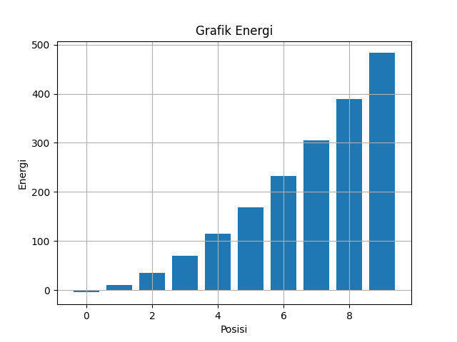
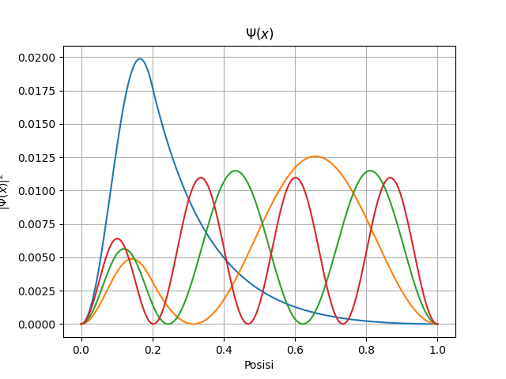
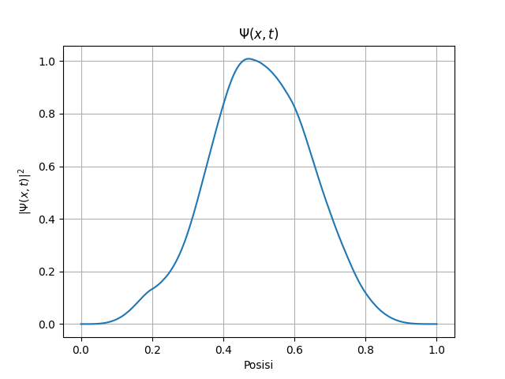

# Potensial Finite

Potensial finite (finite potential well) merupakan model dasar dalam mekanika kuantum yang digunakan untuk merepresentasikan partikel yang terjebak pada suatu daerah dengan energi potensial tertentu. Berbeda dengan potensial infinite, pada potensial finite partikel masih memiliki kemungkinan untuk berada di luar daerah sumur akibat efek tunneling kuantum.

Pada contoh ini digunakan potensial berbentuk sumur persegi satu dimensi dengan kedalaman tertentu pada daerah $∣x∣<0.2$. Potensial didefinisikan sebagai:

$$
V(x) = 
\begin{cases}
    50, &  |y| =< 0.2 \\
    + 0, & |y| >= 0.2.
\end{cases}
$$


**Setup Invorment**
```
import QL1D as qd
import QL1D.util as con
import numpy as np
import matplotlib.pyplot as plt
```

**Parameter**
```
y = np.linspace(0, 1, 200)
psi0 = np.sqrt(2)*np.sin(np.pi*y)
V = np.zeros_like(y)
V[np.abs(y) < 0.2] =- 50
```

**Grafik Finite Potensial**
```
plt.title("Finiti Potensial")
plt.xlabel(r'Posisi')
plt.ylabel(r'Potensial $V(x)$')
plt.plot(y, V)
plt.grid()
plt.show()
```


**Menyelesaikan Persamaan Shroodingern TISE**
```
E, psi, norm  = qd.solver.finite_difference(y, V)
```

**Check Norm**
```
norm
```

```
0.9949748743718593
```

**Grafik Energi**
```
plt.title("Grafik Energi")
plt.xlabel(r'Posisi')
plt.ylabel(r'Energi')
plt.plot([i for i in range(0, 10, 1)], E[0:10])
plt.grid()
plt.show()
```




**Grafik Probabilitas TISE**
```
plt.title(r'$\Psi(x)$')
plt.xlabel("Posisi")
plt.ylabel(r'$|\Psi(x)|^2$')
plt.plot(y, psi.T[0]**2)
plt.plot(y, psi.T[1]**2)
plt.plot(y, psi.T[2]**2)
plt.plot(y, psi.T[3]**2)
plt.grid()
plt.show()
```



**Menyelesaikan Persamaan Shroodingern TDSE**
```
g = qd.solver.psi_m2(0.01, E, psi, psi0)
```

**Grafik Probabilitas TDSE**
```
plt.title(r'$\Psi(x,t)$')
plt.xlabel("Posisi")
plt.ylabel(r'$|\Psi(x, t)|^2$')
plt.plot(y, abs(g)**2)
plt.grid()
plt.show()
```
