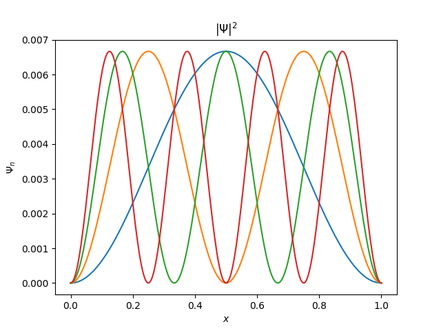

# Potensial Gaussian

Potensial Gaussian merupakan salah satu bentuk potensial halus (smooth potential) yang sering digunakan dalam mekanika kuantum untuk memodelkan interaksi lokal tanpa diskontinuitas tajam. Berbeda dengan potensial kotak, potensial Gaussian berubah secara kontinu sehingga lebih stabil untuk simulasi numerik dan sering digunakan pada studi dinamika paket gelombang kuantum.

Pada contoh ini digunakan potensial Gaussian berbentuk sumur dengan pusat di $x=0.5$ dan lebar tertentu yang dikontrol oleh parameter deviasi standar. Potensial didefinisikan sebagai:

$$
V(x) = -0.01 \exp\left( -\frac{(x - 0.5)^2}{2 \cdot (0.05)^2} \right)
$$

dan fungsi gelombang awal:

$$
\psi_0(x) = \sqrt{2}\sin(\pi x)
$$

**Setup Invorment**
```
import QL1D as qd
import QL1D.util as con
import numpy as np
import matplotlib.pyplot as plt
```

**Parameter**

```
x = np.linspace(0, 1, 301)
V = -1e-2*np.exp(-(x-1/2)**2/(2*(1/20)**2))
psi0 = np.sqrt(2)*np.sin(np.pi*x)
```

**Menyelesaikan Persamaan Shroodinger TISE**

```
E, psi, norm = qd.solver.finite_difference(x, V)
```

**Grafik Probabilitas**

```
plt.plot(psi.T[0]**2)
plt.plot(psi.T[1]**2)
plt.plot(psi.T[2]**2)
plt.plot(psi.T[3]**2)
plt.title(r'Gaussian Potential $V(x) = -0.01 \exp\left( -\frac{(x - 0.5)^2}{2 \cdot (0.05)^2} \right)$')
plt.grid()
plt.show()
```




**Menyelesaikan Persamaan Shroodinger TDSE**

```
t = 0.01
g = qd.solver.psi_m2(t, E, psi, psi0)
plt.plot(x, abs(g)**2)
plt.show()
```


**Check Normalisasi**
```
norm
```

```
0.9966666666666667
```

**Grafik Kenaikan Energi**

```
plt.bar([i for i in range(0, 10, 1)], E[0:10])
```


