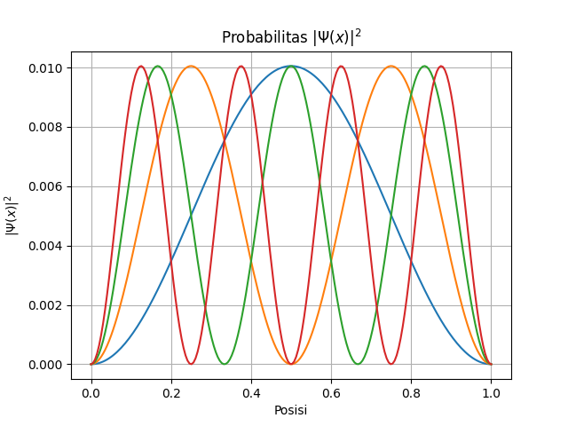
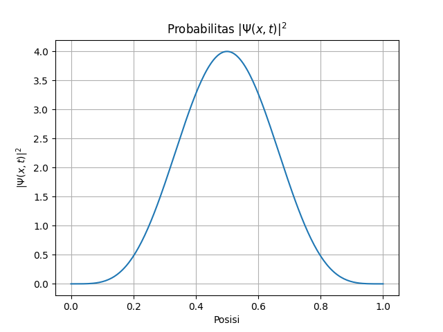
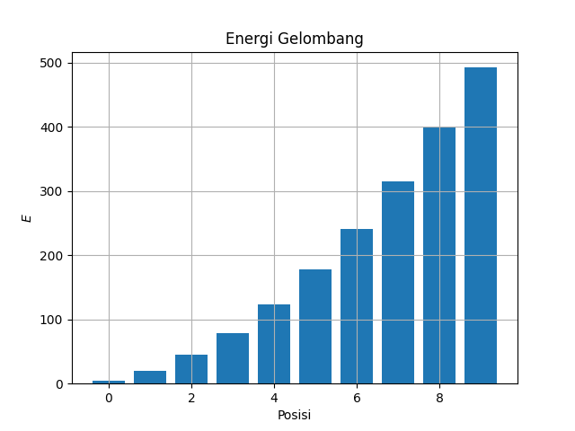

# Potensial Infinite

Potensial infinite (infinite potential well) merupakan model dasar dalam mekanika kuantum yang digunakan untuk menggambarkan partikel yang terkungkung sempurna di dalam suatu daerah ruang. Pada model ini, potensial di luar daerah sumur bernilai tak hingga sehingga partikel tidak dapat keluar dari wilayah tersebut.

Potensial Infinite didefinisikan sebagai:

$$
V(x) = 
\begin{cases}
    0, & 0 < x < 1 \\
    + \infty, & \text{lainnya}.
\end{cases}
$$

Karena partikel terjebak sempurna di dalam sumur, solusi Persamaan Schrödinger menghasilkan tingkat energi yang terkuantisasi.

Energi pada infinite:

$$
E = \frac{n^2 \pi^2 \hbar^2}{2 m L^2}
$$

$n = 1, 2, 3, ..., i$

Setiap nilai n merepresentasikan keadaan kuantum yang berbeda, di mana energi partikel hanya dapat berada pada nilai-nilai tertentu dan tidak kontinu

$\Psi_0$ didefinisikan sebagai:

$$
\Psi_0(y) = \sqrt{2}\sin{(y \pi)}
$$


**Setup Invorment**
```
import QL1D as qd
import QL1D.util as con
import numpy as np
import matplotlib.pyplot as plt
```

**Parameter**

```
y = np.linspace(0, 1, 2000)
V = np.zeros_like(y)
psi0 = np.sqrt(2)*np.sin(np.pi*y)
```

**Menyelesaikan Persamaan Shroodinger TISE**

```
E, psi, norm = qd.solver.finite_difference(y, V)
```

**Normalisasi**
```
norm
```

```
0.9949748743718592
```

**Grafik Probabilitas $|\Psi(x)|^2$**

```
plt.title(r'Probabilitas $|\Psi(x)|^2$')
plt.xlabel("posisi")
plt.ylabel(r'$|\Psi(x)|^2$')
plt.plot(y, psi.T[0]**2)
plt.plot(y, psi.T[1]**2)
plt.plot(y, psi.T[2]**2)
plt.plot(y, psi.T[3]**2)
plt.grid()
plt.show()
```



**Grafik Probabilitas $|\Psi(x,t)|^2$**

```
plt.title(r'Probabilitas $|\Psi(x, t)|^2$')
plt.xlabel("Posisi")
plt.ylabel(r'$|\Psi(x,t)|^2$')
plt.plot(y, abs(g)**2)
plt.grid()
plt.show()
```



**Grafik Energi Gelombang**

```
plt.title("Energi Gelombang")
plt.bar([i for i in range(0, 10, 1)], E[0:10])
plt.xlabel(r'Posisi')
plt.ylabel(r'$E$')
plt.grid()
plt.show()
```



**Membandingkan Dengan analitik**
```
x = np.array([1, 2, 3])
E_analitik = (x**2 * np.pi**2)/2
```

```
E[:3]
```

```
[ 4.93480119 19.73919255 44.41313753]
```

```
E_analitik[:3]
```

```
[ 4.9348022 19.7392088 44.4132198]
```
