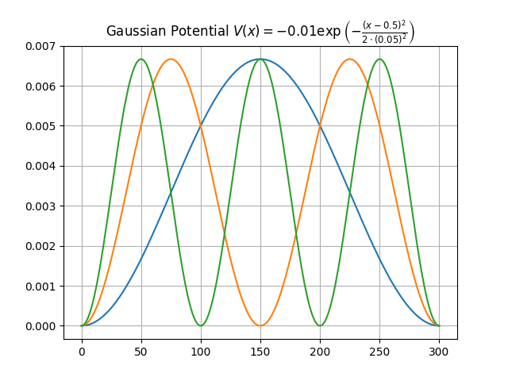

# QL1D Documentation

Quantum Library 1 Dimensi adalah sebuah library python untuk menyelesaikan persamaan Schrödinger 1 dimensi, baik:

1. Time Independent Schrödinger Equation (TISE)
2. Time Dependent Schrödinger Equation (TDSE)

QL1D dirancang untuk membantu pembelajaran mekanika kuantum melalui simulasi numerik, visualisasi fungsi gelombang, dan eksplorasi berbagai bentuk potensial kuantum.

<!-- Dokumentasi Section
    - instalasi
    - Memulai
    - TISE Solver
    - TDSE Solver
    - Potentials
    - Visualization
    - Examples

 -->
### Dokumentasi
